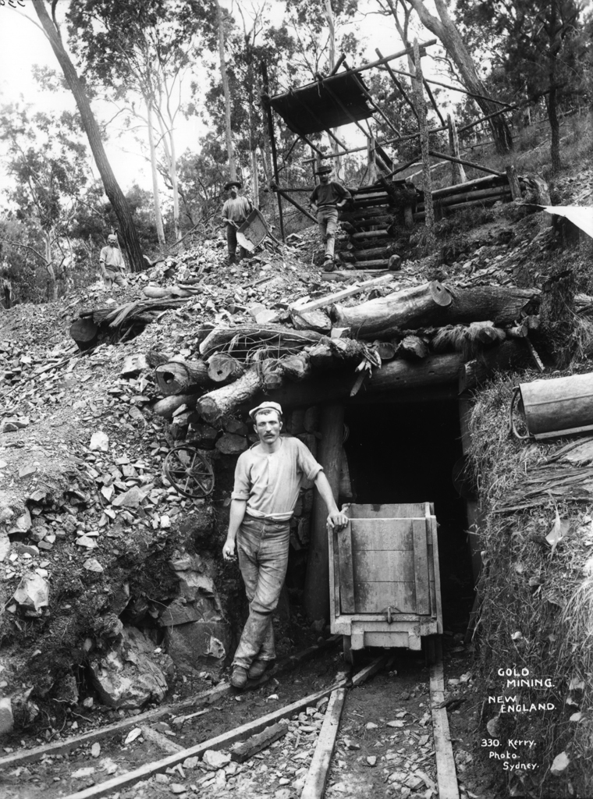
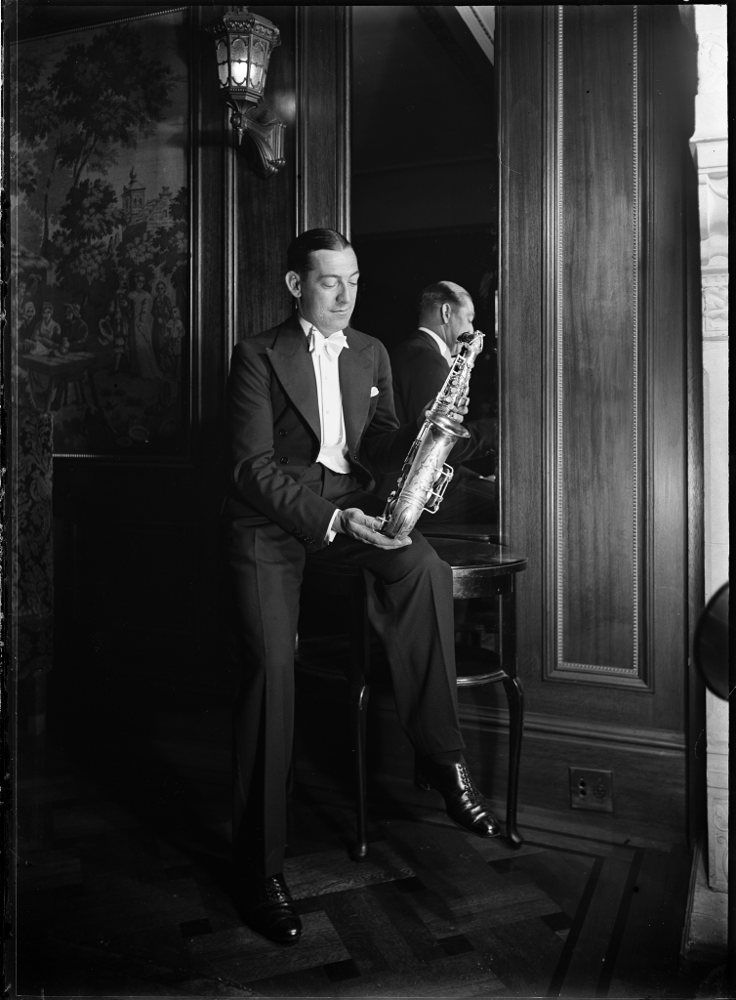
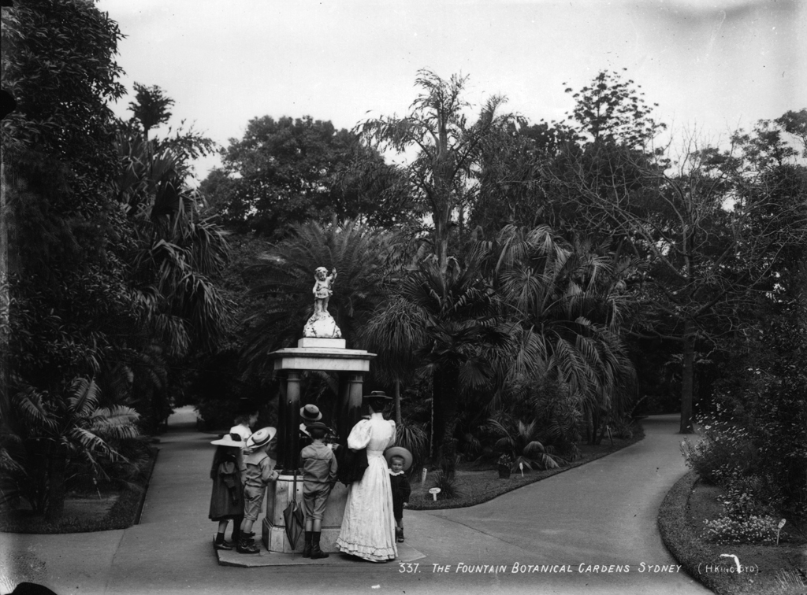

# ImageProcessing

**Image Colorization**

**Main Objetive**: Image colorization (from Grayscale to RGB)

**Input Images**: As imagens de entrada serão em preto e branco. Selecionamos algumas fotos dessa base: https://www.flickr.com/photos/powerhouse_museum/albums (No known restrictions on publication.)

Exemplos:

 
 

**Passos**:
-  Alicar técnicas de enhancement nas fotos que forem necessárias.
-  Colorir as fotos através de técnicas de CNN ou DeepLearning.
 

Código inicial:
