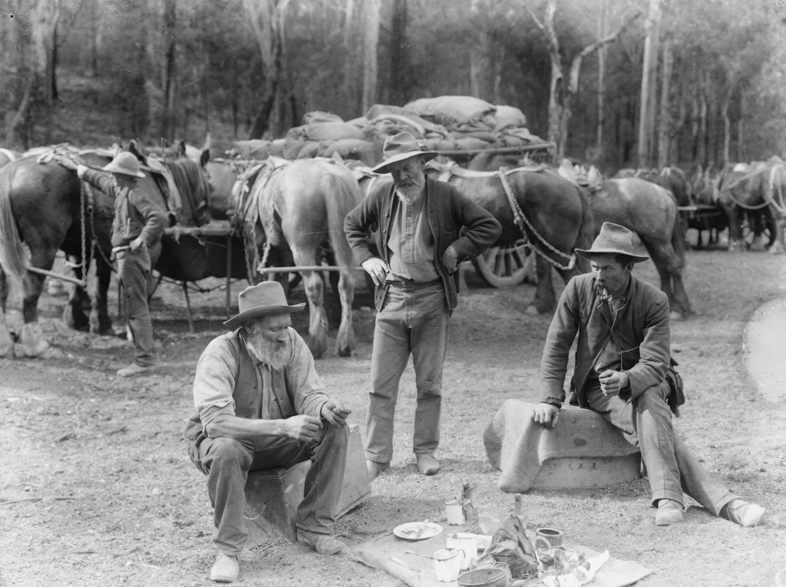
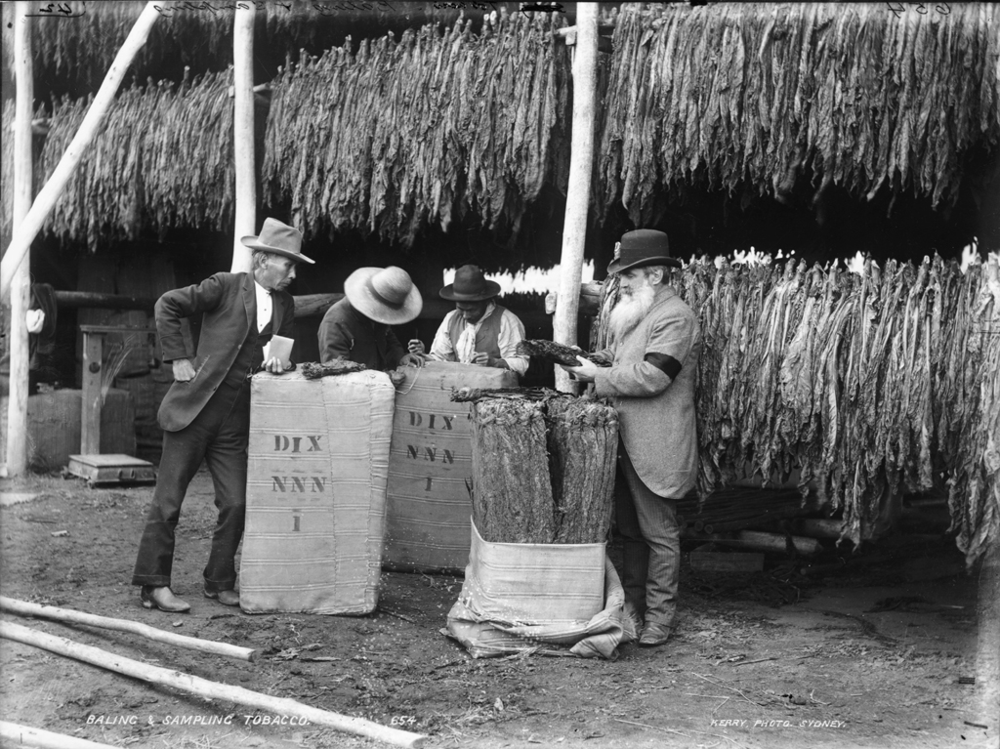
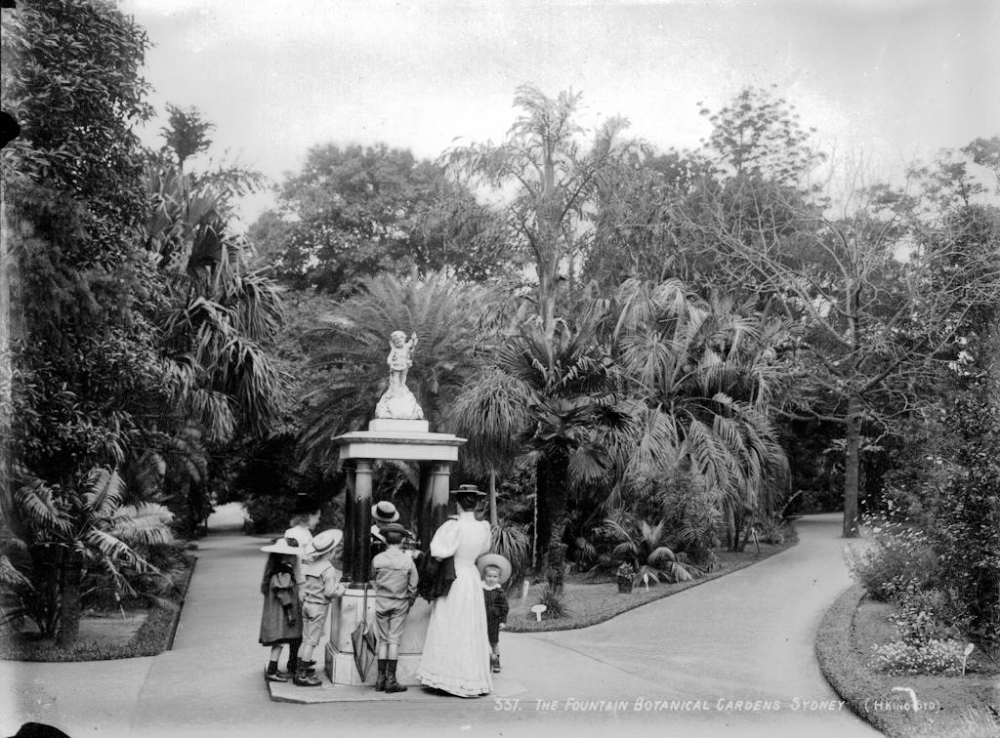
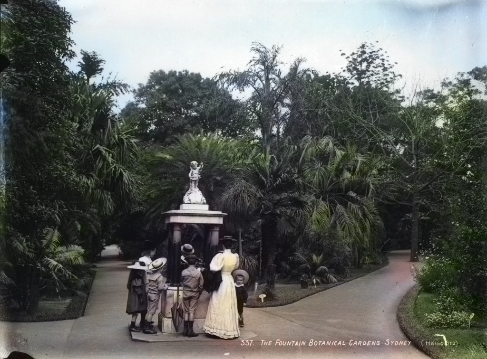

# ImageProcessing

**Image Colorization**

**Main Objetive:** Image colorization (from Grayscale to RGB)

**Input Images:** As imagens de entrada serão em preto e branco. Selecionamos algumas fotos dessa base: https://www.flickr.com/photos/powerhouse_museum/albums (No known restrictions on publication.)

Exemplos:

 
 

**Passos:**
-  Aplicar técnicas de enhancement nas fotos que forem necessárias.
   1. Aplicaremos a técnica de histograma cumulativo, histograma equalization e gamma enhancement.
   2. Utilizaremos a imagem resultante do passo anterior para colorir.
-  Colorir as imagens através de técnicas de CNN/DeepLearning.
   1. Converter a imagen de entrada para o Lab color space.
   2. Usar o canal L como entrada para a rede de treinamento tentar prever os canais 'a' e 'b'.
   3. Combinar o canal L de entrada com os caneis 'a' e 'b' que foram previstos.
   4. Converter a imagem do formato Lab para o formato RGB.
 

**Código inicial:** Projeto_final.py

**Resltados:**
- Original:
   
   
- Histogram Enhancement:
   
   
- Gamma Enhancement: 

   
- Colored:

   
